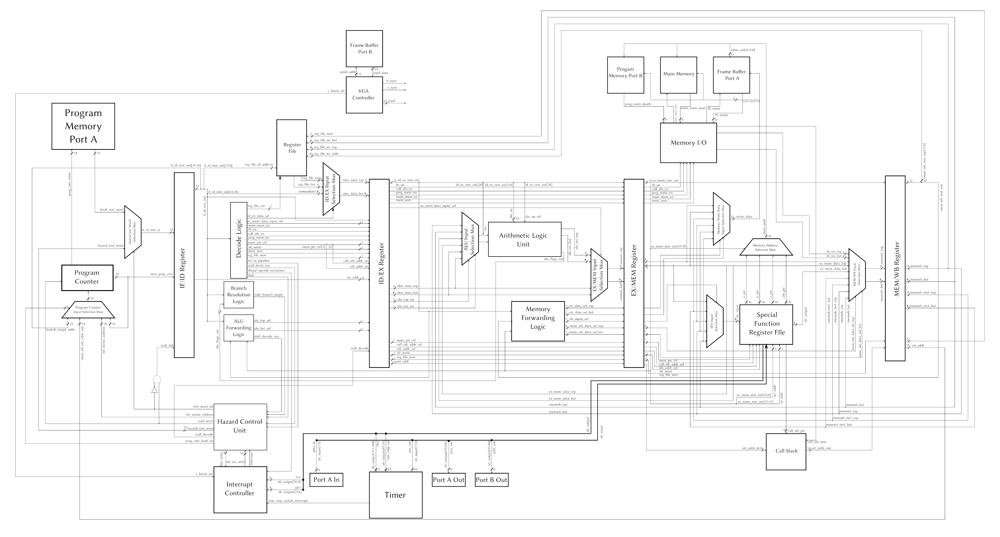
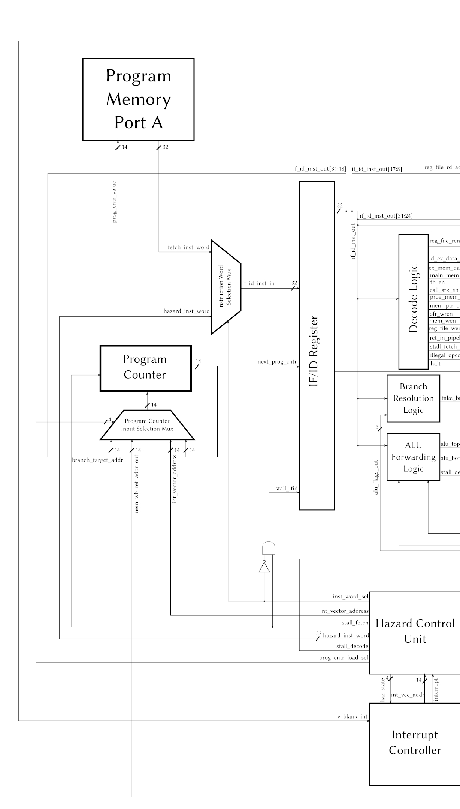
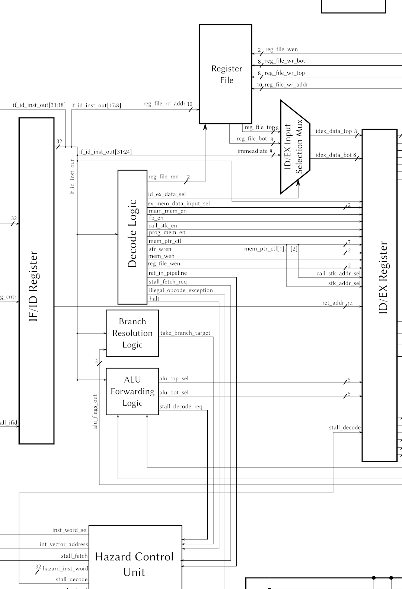
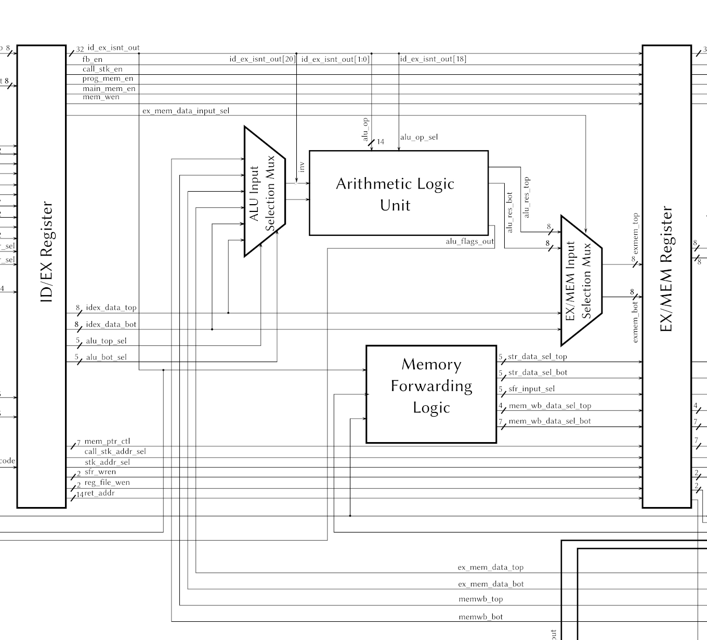
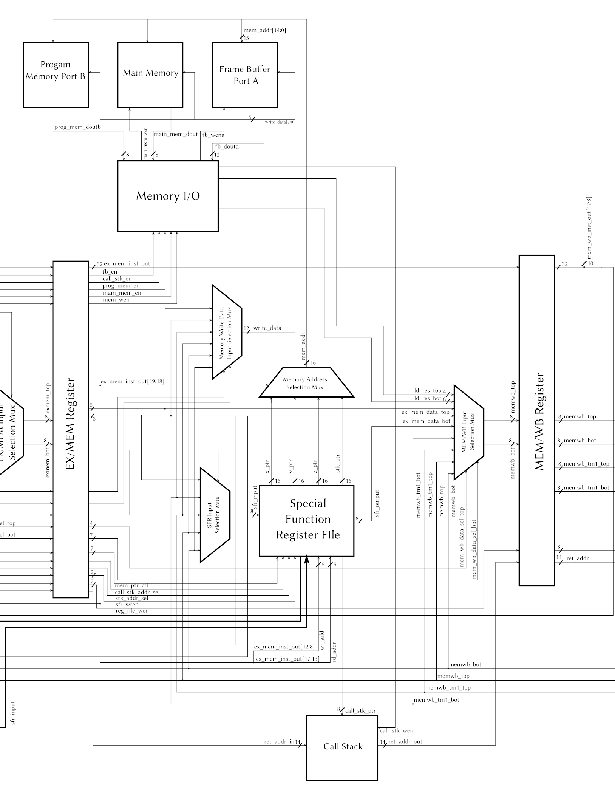
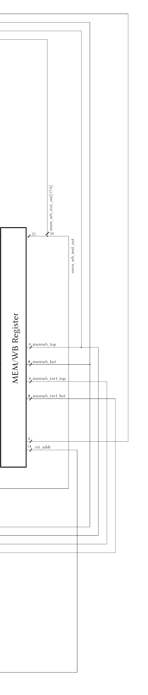

# HdlMicroProcessor
8-bit Microprocessor with 5-stage RISC Pipeline

## Project Goals

## Design Overview
My processor utilizes a 5 stage pipeline to increase the performance of the processor. This was done mainly because I wanted to design something more complex to challenge myself and reinforce advanced topics in computer architecture. This resulted in a full System on Chip that includes a VGA controller that outputs a 160x120 progressive signal at 12-Bits per pixel and uses a framebuffer tightly coupled to the core. A 64-Bit timer for simple performance evaluation and future plans for PWM modules. My design also contains an interrupt controller for I/O and ensures that the framebuffer is only written to during the vertical blanking period for prevention of screen tearing. Delving into the core, there are five pipeline stages: fetch decode, execute, memory, and writeback. The core is mostly bypassed due to a few oversights on my part when writing the pipeline hazard detection and avoidance modules. Pipelining allows for significantly higher clock frequencies than a single cycle design while maintaining the effective execution latency of the single cycle design.

## Verifacation & Validation
### CocoTB & GTKWave
### VGA
### CPU Simulation
### FPGA Validation

## Design Retrospective
Using the modern FPGA rather than the old lattice part allows a much more integrated fast system. Based on static timing analysis, the highest clock speed this design would reach is approximately 50 MHz. Most instructions will work well over a hundred MHz, but due to a misguided design decision, any branch occurring directly after an arithmetic instruction creates a massive time constraint as it forces the branch resolution logic data outputs to be valid before the negative edge of the clock to ensure the hazard unit sequences a taken branch correctly. Because, I designed the Branch Resolution logic to simply look at the flags asynchronously in the decode stage, while the arithmetic instruction executes in the execute stage, I made it to where every arithmetic operation has be be finished before the negative edge of the clock. This greatly increases cycle time in order to ensure correct operation of branches following arithmetic. I made this decision because it reduced the taken branch penalty to a single cycle, while allowing not taken branches to have no penalty. There are two solutions to this problem. The first, which I would choose, is to move the branch resolution logic to the execute stage and read from the flags register. This has one disadvantage in making the penalty for a taken branch 2 cycles rather than 1 a 50% increase on the effective latency of that instruction, but granting a much lower cycle time. To facilitate this change some slight modifications must be made to the hazard control unit for sequencing the a taken branch and invalidating the two instructions fetch directly after the taken branch. The second option, which is more time and resource intensive, is to add a second ALU into the decode stage and reject the use of a condition code register all together. This would match RISC-V’s implementation of branch instructions. It would leave taken branches with a penalty with a penalty of two cycles because two register values would have to be read, operated on, than the results would have to be examined, a lengthy process with high latency. This solution would work well on deeper pipelines that split decode into multiple stages.

The second big issue with my design that limits clock speed is how I access memory. My design must run the memory at twice the frequency of the core to ensure single cycle latency for reads. This means that I limited in core frequency by the fundamental limit of the memory blocks on the Spartan 7 FPGA of around 300 MHz. To improve clock speed each stage that access memory would have to be pipelined, bringing the total depth of the integer pipeline to 7 stages. It would also increase the taken branch penalty to 3 cycles, a serious limiter of performance. Adding the extra memory stages would not be a performance issue as a new address would be able to be issued to the memory unit every cycle, results would not be valid for one extra cycle but the throughput would remain identical to the current implementation ignoring taken branches which would invalidate three instructions rather than just one. Moving to the data memory access stages, unlike the fetch port, would not lose any throughput as accesses will still be pipelined. Although arithmetic stalls would incur a two cycle penalty rather than one. Overall, these changes would reduce Instructions Per Clock, but the frequency increases greatly outweigh that loss, conservatively increasing the performance of the core by 50%.

I would highly recommend the Xilinx hardware. The simplicity of having a single board with no external wires that can greatly outperform the older system is excellent. On top of that, the solutions are significantly cheaper. I think the school should should move to the use of Digilent’s Basys 3 board which uses a slightly smaller then my Spartan 7 50, Artix 7 35. The basys has a VGA connector built in, a 4 digit 7-segment display, tons of switches, and four pmod connectors, allowing for great flexibility in projects for digital labs. The one downside is the sheer size of the Vivado toolchain which comes in at around 60 GB, and requires 100 GB to be free in order to install it. Overall, switching from the old Lattice parts to Xilinx would bring our students into contact with tools they are significantly more likely to encounter in their future careers.

To wrap up, I am glad I went with the pipelined design. It presented my with a significant challenge, while also spicing up my semester. I would call this project a success, though, I wish I had written more demos to show off my VGA controller, but alas. That is what the summer is for. I may even write a C compiler backend. Thanks for offering the class Professor Maher.
## Microarchitecture

### Memory Architecture
My processor has a Harvard memory architecture. What that means is that the data and instruction memories are split. In my case, I have one ROM that stores the instructions and any constant data baked into a program. The other parts of the memory structure are the Framebuffer and Main memory. These are both RAM’s that are used for two separate things, which I will dive into shortly. All memories can complete a read and write within a single CPU cycle. This is achieved by running the memory clock at exactly twice the frequency of the core. This happens to be the number one performance bottleneck in this architecture.
#### Program Memory
The program will be loaded into an FPGA block ram at program time then accessed by the pipeline. This memory is a dual ported 64 kB BRAM. The fetch port will have a 32 bit data bus and a 14 bit address bus. The memory access unit port will have an 8 bit data bus and a 16 bit address bus.
#### Data Memory
64 kB of RAM. This is stored on the FPGA. It has a single access port with a 16-bit address bus and an 8-bit data bus. This can only be accessed by the cpu.
#### Call Stack
The call stack is a small block ram that stores return addresses. These are 14-bit words. In total, this memory can store up to 256 of those return addresses. Thus it is indexed by an 8-but stack pointer register. Because this memory will only store the call stack, the pointer register shall count up from address 0 which will be clocked in on system reset.
#### Frame Buffer
This is a dual ported memory that stores exactly enough data to store a single 160x120 frame with 12-bit per pixel color data. This will be read by the VGA controller and drawn to a display. It will be read and written to by the cpu using load and store instructions.
### Pipeline
My processor utilizes a 5-stage execution pipeline to increase total instruction throughput, and thus overall performance relative to a sequential or single cycle machine. The five stages are, in this order, Fetch, Decode, Execute, Memory, and Writeback. A special register, called a pipeline register, separates each stage of the pipeline. These registers store every control signal, or data value needed for an instruction to execute properly in the next stage. With that said, I will go into more detailed descriptions of each pipeline stage.
#### Functional Units
1. Instruction Word Selection Multiplexor. This module allows the hazard control unit to select between either the output of the fetch port of program memory or its own 32-Bit instruction bus as inputs into the first pipeline register, IF/ID. This feature is used for coordinating stalls and interrupts. Say we need to stall the fetch stage for a cycle, we do not want whatever instruction was being fetched from program memory by the program counter that cycle to enter the pipeline. So, by asserting this multiplexor’s select signal, the hazard control unit can insert a nop into the pipeline. It can also insert a call instruction in the case of an interrupt.
2. Register File. This module is a 32 entry 8-Bit register file. It has two read ports, as well as two write ports. This is a reasonably sized register file allowing for longer programs that do not have to touch memory for full operation, improving speed of hand optimized assembly and potentially compiled code without the need to implement the complex hardware algorithms for register renaming.
#### Fetch Stage
  
The fetch stage is one of the simpler stages. It only has two modules within it. The program counter, and a multiplexor, controlled by the cpu control state machine, selects the next value of the program counter. There are four: the current value incremented, a return address, a branch target address, or an interrupt vector address. The program counter can also be stalled. In this case it simply keeps the same value.
##### Functional Units
1. Program Counter Input Selection Multiplexor. This module is controlled by the pipeline hazard control state machine. Effectively, it is used so that the hazard control unit can insert an arbitrary instruction into the pipeline when the need arises in case of control flow instructions (CALL), interrupts (CALL), or pipeline hazards (NOP).
2. Program Counter. This module is used as the address for the fetch port of program memory. TThe value stored in it is the address, in program memory of the next instruction to be put into the pipeline.It outputs the its current value + 1 for propagating down the pipeline for any potential call instructions it may fetch(return address), that value is also sent to the program counter input selection mux, and is the default value to be placed at the output of that multiplexor. It has a stall signal that may be asserted by the hazard control unit in order to keep the value stored in the program counter the same across two cycles, effectively stalling the pipeline.
#### Decode Stage
  
This stage translates instruction words into operands and control signals to be propagated through the pipeline. It also checks for data dependencies in relation to arithmetic operations and either stalls, or forwards operands from the execute stage or memory stage by generating control signals based on register addresses in subsequent pipeline registers. It also checks the alu flags when a control flow instruction is encountered to know whether to stall on a taken branch instruction or allow the instruction fetched in the branch’s decode cycle to propagate through the pipeline. Register file reads also occur in this stage. All register reads are clocked on the negative edge of the clock. This allows writes and reads to the same register to occur within the same clock cycle. This ia a hard requirement for a pipelined processor.
##### Functional Units
1. Decode Logic. This module looks at the current instruction and generates any control signal for it that has no potential to cause a pipeline hazard. It also looks for special instructions like return, halt, or an illegal opcode, and alerts the hazard unit and interrupt controller of the events.
2. Branch Resolution Logic. This simply looks at the whether the instruction in IF/ID is a Jump or Branch instruction, based on bits [10:8] in the instruction word and the alu result flags from the operation occurring during that same cycle, determines whether to take a branch. If the branch is taken,  It alerts the Hazard Unit incurring a stall.
3. ALU Forwarding Logic. This module Looks at the instructions in IF/ID, ID/EX, and EX/MEM and determines if any data dependencies exist and either stalls to wait for a load result, or simply choose the selection signals for the alu input selection mux.
4. ID/EX Selection Mux. This determines whether immediate data values, or the register file read values are latched into ID/EX on the next clock cycle.
#### Execute Stage
  
The execute stage has two major functions. First it has the Arithmetic Logic Unit which performs all the calculations of the CPU. Second it checks for data hazards related to writes to either memory or the special function register file. If a hazard is found, multiplexor control signals are generated that ensure that the sequential model of execution is presented to the programmer.
##### Functional Units
1. Alu Input Mux. This mux can send 1 of 5 data values into each operand port of the alu. ID/EX top and bottom to the top and bottom operand respectively. Both operand ports can take both data values stored in EX/MEM, and MEM/WB.
2. ALU. This module contains a multiplier, bit shifter, adder/subtractor, and bitwise logic unit. It uses a common result bus with the low 2-bits of the instruction word effectively encoding a selection signal to generate individual output enable signals to each of the four functional units within the alu, ensuring no bus conflicts occur.
3. Memory forwarding logic. This module looks at the instructions in the ID/EX, EXX/MEM, and MEM/WB pipeline registers and decides whether or not data needs to be forwarded to ensure correct execution.
4. EX/MEM Data Input Selection Multiplexor. This module simply selects between the ID/EX data values and the alu result bytes for latching into the data of EX/MEM.
#### Memory Acess Stage
  
This stage handles all data related memory accesses This is done by sending the memory write enable signal along with a one hot vector that selects which memory interface is being used. This includes tasks such as ensuring that the correct data is sent to the memory blocks depending on specific streams of instructions and their data dependencies. This is done using three multiplexers in this stage. One to ensure that the data being written to the Special Function Register File is correct. One to ensure the data being written to memory is correct. And, finally a multiplexor to ensure that the correct data is latched into the MEM/WB register on the next positive edge of the clock. IT also contains the Special function register file which is used for controlling I/O operations such as stack pointers, and the three architectural memory pointers, X, Y & Z. A multiplexor controlled by bit in the instruction word will control which of the four pointer options will be presented to the memory blocks. Other values the sfr stores are the LED output register, the 64-bit timer value, a 64-bit value for triggering timer compare matches, PWM?, and registers to control the timer, interrupt controller, and which interrupts are enabled. All forwarding capable multiplexes in this stage are controlled by the memory forwarding logic in the execute stage.
##### Functional Units
1. Special Function Register File:32 8-Bit registers. This contains 4 16-bit pointer registers X, Y, Z, and the stack pointer. It also contains the call stack pointer. The two stack pointers will be incrementable as well as decrementable. It will also contain I/O registers (input and output will be separate) along with peripheral control registers to control timers
2. SFR File Input Multiplexer: This mux is used to forward either the bottom data value of the ex/mem pipeline or the current data values in MEM/WB and the previous data Values into MEM/WB.
3. Memory Address Multiplexer: Potential address inputs: X, Y & Z pointers, Stack Pointer. It termines which to use based on bits 18, and 18 in the instruction word stored in EX/MEM.
4. Memory Data Multiplexer: Potential inputs: EX/MEM top & bottom data, MEM/WB top & bottom, MEM/WB Time - 1 Top & Bottom.
5. MEM/WB register data input Multiplexer: Potential inputs: EX/MEM top & bottom data, SFR read data, MEM/WB top & bottom, and MEM/WB Time - 1
#### Writeback Stage
  
This stage is quite simple relative to the Execute and Memory stages. It simply sends the requisite data, address, and write enable signals to the general purpose register file, along with a return address popped off of the call stack for jumping too upon completion of a return instruction.
#### Pipeline Registers
1. IF/ID. This module stores the selected instruction word (hazard unit || program memory), and the address of the instruction directly following it in memory.
2. ID/EX. This module stores the instruction word previously in IF/ID, and the address of the instruction directly following it in memory. It also stores all control signals generated in the decode pipeline stage (Alu Top & Bottom Operand Select, Memory Write Enable, Main Memory, Program Memory, Call Stack , and Frame Buffer Enable, Memory Pointer Control Signals, (these are double latched to ensure the increments or decrements occur after the address has been used, Call Stack & Stack Address Sel (Ensure correct values are pushed and popped), EX/MEM Data Input Select, Register File Write Enable, SFR File Write & Read Enable), along with the data operands.
3. EX/MEM. This module stores the instruction word previously in EX/MEM, and the address of the instruction directly following it in memory. It also stores all control signals generated in the decode pipeline stage (Memory Write Enable, Main Memory, Program Memory, Call Stack, and Frame Buffer Enable, Memory Pointer Control Signals, Call Stack & Stack Address Sel (Ensure correct values are pushed and popped), EX/MEM Data Input Select, Register File Write Enable, SFR File Write & Read Enable), along with the data operands.
4. MEM/WB. This module stores the instruction word previously in EX/MEM, and the address read out of the call stack. It also stores the data outputs of the memory stage and the values previously stored in itself.
## Programmers Model
### Instruction Set
1. No Operation - NOP  
	Simply wastes 1 instruction cycle. This will be the same number of clock cycles as the quickest instruction that actually does something. The effective cycle latency is 1 Cycle.  
2. Increment - INC Rx  
	This instruction increments the given register. The effective cycle latency is 1 Cycle.  
	Rx <- Rx + 1  
3. Decrement - DEC Rx  
	This instruction decrements the given register. The effective cycle latency is 1 Cycle.  
	Rx <- Rx - 1  
4. Add - ADD Rx, Ry - ADDI Rx, k  
	This instruction either adds two registers or an immediate value to a register. The effective cycle latency is 1 Cycle.  
	Rx <- Rx + Ry  
	Rx <- Rx + k  
5. Subtract - SUB Rx, Ry - SUBI Rx, k  
	This instruction subtracts two registers or a register and an immediate value. The effective cycle latency is 1 Cycle.  
	Rx <- Rx - Ry  
	Rx <- Rx - k  
6. Compare - CP Rx, Ry - CPI Rx, k  
	This instruction subtracts the second operand from the first, but does not store the result. Thus only relevant flags are produced for any subsequent control flow instruction to make use of. The effective cycle latency is 1 Cycle.  
7. Multiply - MUL Rx, Ry - MULI Rx, Rx1,  k  
	This instruction multiplies either two registers or a register and an immediate value. The effective cycle latency is 1 Cycle.  
	Rx, Ry <- Rx * Ry  
	Rx, Ry <- Rx * k  
8. And - AND Rx, Ry - ANDI Rx, k  
	This instruction performs a bitwise and between either two registers or a register and an immediate value. The effective cycle latency is 1 Cycle.  
	Rx <- Rx & Ry  
	Rx <- Rx & k  
9. Or - OR Rx, Ry - ORI Rx, k  
This instruction performs a bitwise or between either two registers or a register and an immediate value. The effective cycle latency is 1 Cycle.  
	Rx <- Rx | Ry  
	Rx <- Rx | k  
10. Shift Right - SHR Rx  
	This instruction shifts the source register right by a single bit storing the result in the destination register. A zero is shifted into the high bit, which is not shifted into the carry flag. The effective cycle latency is 1 Cycle.  
	Rx <- Rx >> 1  
11. Shift Left - SHL Rx  
	This instruction shifts the source register left by a single bit storing the result in the destination register. A zero is shifted into the lowbit, which is not shifted into the carry flag. The effective cycle latency is 1 Cycle.  
	Rx <- Rx << 1  
12. Complement - COM Rx  
	This instruction will take the two’s complement of a given register. The effective cycle latency is 1 Cycle.  
	Rx <- ~Rx + 1  
13. Invert - INV Rx  
	This instruction inverts all the bits in a given register. The effective cycle latency is 1 Cycle.  
	Rx <- ~Rx  
14. Load - LD Rx, (addr) - LDFB Rx, Ry (addr)  
	This instruction loads a value from a specific memory address into a register or register pair. The effective cycle latency is 1 Cycle.  
	Rx <- (ptr)  
	Rx, Ry <- (ptr) (For LDFB 12 bits are loaded, the top byte is zero extended to 16-Bits)  
15. Load Immediate - LDI Rx, k  
	This instruction stores an 8-Bit immediate data value into the specified register. The effective cycle latency is 1 Cycle.  
	Rx <- k  
16. Load From Program Memory - LPM Rx, Z  
	This instruction loads the contents of program memory pointed by the value in the Z register and writes it to register Rx. The effective cycle latency is 1 Cycle.  
	Rx <- (ptr)  
17. Store - ST (addr), Rx - STFB (addr) Rx, Ry  
	This instruction stores the value in the source register into the destination register. The effective cycle latency is 1 Cycle.  
	(addr) <- Rx  
	(addr) <- Rx, Ry  
18. Move - MOVR Rx, Ry - MOV (addr0), (addr1)  
	This instruction moves a value between two addresses in data memory or two registers. The effective cycle latency is 1 Cycle.  
	Rx <- Ry  
	(addr0) <- (addr1)  
19. In - IN Rx, SFRy  
	This instruction reads in a value from one of the 32 special function registers into a general purpose register. The effective cycle latency is 1 Cycle.  
	Rx <- SFRx  
20. Out - OUT SFRx, Rx  
	This instruction stores the values in a specified GPR into the specified SFR. The effective cycle latency is 1 Cycle.  
	SFRx <- Rx  
21. Jump - JMP apma					(absolute program memory address)  
	This instruction changes the program counter to the absolute program memory address provided in an immediate fashion. The effective cycle latency is 2 Cycles.  
	PC <- apma  
22. Branch If Carry Set - BRCS apma  
	This instruction sets the program counter to the specified absolute program memory address if the carry flag is set. The effective cycle latency is 2 Cycles.  
	Carry flag ? PC <- apma : PC <- PC  
23. Branch If Carry Clear - BRCC apma  
	This instruction sets the program counter to the specified absolute program memory address if the carry flag is cleared. The effective cycle latency is 2 Cycles.  
	Carry flag ? PC <- PC : PC <- apma  
24. Branch If Equal - BREQ apma  
	This instruction sets the program counter to the specified absolute program memory address if the zero flag is set. The effective cycle latency is 2 Cycles.  
	Z flag ? PC <- apma : PC <- PC  
25. Branch If Not Equal - BRNE apma  
	This instruction sets the program counter to the specified absolute program memory address if the zero flag is cleared. The effective cycle latency is 2 Cycles.  
	Z flag ? PC <- PC : PC <- apma  
26. Branch If Negative - BRNQ apma  
	This instruction sets the program counter to the specified absolute program memory address if the negative flag is set. The effective cycle latency is 2 Cycles.  
	Negative flag ? PC <- apma : PC <- PC  
27. Branch If Positive - BRPS apma  
	This instruction sets the program counter to the specified absolute program memory address if the negative flag is cleared. The effective cycle latency is 2 Cycles.  
	Negative flag ? PC <- PC : PC <- apma  
28. Call - CALL apma  
	This instruction pushes the address of the next instruction onto the stack and then loads the absolute program memory address into the Program Counter. The effective cycle latency is 2 Cycles.  
	(CSP) <- PC + 1  
	 CSP  <- CSP + 1  
	 PC  <- apma  
29. Return - RET  
	This instruction pops the previously pushed return address into the program counter. The effective cycle latency is 5 Cycles.  
	PC <- (CSP)  
	CSP <- CSP - 1  
30. Return From Interrupt - RETI  
	This instruction is identical to return except it alerts the interrupt controller that the program has left its interrupt service routine. This allows for nested interrupts. The effective cycle latency is 5 Cycles.  
	PC <- (CSP)  
	CSP <- CSP - 1  
31. Push - PUSH Rx  
	This instruction pushes the contents of register Rx onto the stack. The effective cycle latency is 1 Cycle.  
	(SP) <- Rx  
	SP <- SP - 1 (8-bit registers)  
32. Pop - POP Rx  
	This instruction pops the contents of memory pointed to by the stack pointer and places that value in register Rx. The effective cycle latency is 1 Cycle.  
	Rx <- (SP)  
	SP <- SP + 1  
33. Halt - HLT  
	This instruction halts the processor. Only a reset or interrupt can restore the cpu to operation. The effective cycle latency is 1 Cycle.  

### Errata
In the case of instructions that require two register operands, if each of the two instructions preceding it have exactly 1 unique dependency for the originally mentioned instruction, the hazard detection and forwarding units will not detect the hazard and thus the chance for incorrect execution is almost guaranteed unless two NOPS are inserted between the final dependent instruction and the two preceding hazardous writes.

Any pointer increment or decrement does not take effect until the next cycle. Thus, it is advised that the programmer not write sequential memory instructions with increments on the same pointer. They should either add a single NOP, or, if they can perform interleaving of independent memory accesses use that.

It should be noted that if the CPU were to interrupt  when any instruction that affects the flags is being fetched from Program Memory, and an instuction that uses those results directly follows the original instruction, upon return from that interrupt, correct program execution will be lost. This occurs because, I do not save the flags rather, any instruction that utilizes the information contained in those flags is resolved by the end of the negative edge of the clock. To resolve this issue, a flags register stack must be implemented. A push will occur when the interrupt inserted call reaches the execute stage and vice versa.

### Register Descriptions
Each list number represents the described register's address in the SFR File  
1. Stack Pointer Low (SPL)  
Low byte of the 16-Bit stack pointer.  
2. Stack Pointer High (SPH)  
High Byte of the 16-Bit stack pointer.  
3. X Pointer Low (XL)  
Low byte of the 16-Bit X pointer.  
4. X Pointer High (XH)  
High byte of the 16-Bit X pointer.  
5. Y Pointer Low (YL)  
Low byte of the 16-Bit Y pointer.  
6. Y Pointer High (YH)  
High byte of the 16-Bit Y pointer.  
7. Z Pointer Low (ZL)  
Low byte of the 16-Bit Z pointer.  
8. Z Pointer High (ZH)  
High byte of the 16-Bit Z pointer.  
9. Timer One Control Register (T1CR)  
Bit <0> is a timer enable bit. If it is set, the timer will increment on every clock cycle. Bit <1> is a clear bit. If set, it will clear the value in the timer.  
10. Call Stack Pointer (CSP)  
8-Bit call stack pointer. The user can set this, but it does not actually matter so long as no function calls go more than 256 deep.  
11. LED (LED)  
This register is directly connected to LED on the board of the Arty S7.  
12. Interrupt Controller Control Register (ICCR)  
This register controls the operation of the interrupt controller. If bit <0> is set, the interrupt controller will accept interrupts, otherwise it will ignore any detected interrupt conditions.  
13. General Interrupt Control Register (GICR)  
This register is used as a mask register. If bit <0> is set, the interrupt controller will look for interrupt conditions on the vblank interrupt line. If bit <1> is set, the interrupt controller will look for interrupt conditions coming from an illegal opcode exception. If bit <2> is set, the interrupt controller will look for interrupt conditions on the timer compare match line.  
14. Timer Compare Byte 0 (TCB0)  
Byte 0 of the value that is compared to the timer value in the timer. The full value is 64-Bits.  
15. Timer Compare Byte 1 (TCB1)  
Byte 1 of the value that is compared to the timer value in the timer. The full value is 64-Bits.  
16. Timer Compare Byte 2 (TCB2)  
Byte 2 of the value that is compared to the timer value in the timer. The full value is 64-Bits.  
17. Timer Compare Byte 3 (TCB3)  
Byte 3 of the value that is compared to the timer value in the timer. The full value is 64-Bits.  
18. Timer Compare Byte 4 (TCB4)  
Byte 4 of the value that is compared to the timer value in the timer. The full value is 64-Bits.  
19. Timer Compare Byte 5 (TCB5)  
Byte 5 of the value that is compared to the timer value in the timer. The full value is 64-Bits.  
20. Timer Compare Byte 6 (TCB6)  
Byte 6 of the value that is compared to the timer value in the timer. The full value is 64-Bits.  
21. Timer Compare Byte 7 (TCB7)  
Byte 7 of the value that is compared to the timer value in the timer. The full value is 64-Bits.  
22. Port B Out (PBOUT)  
The value stored in this register is output onto 8 pins external to the FPGA. It is used for general purpose output.  
23. Port A Out (PAOUT)  
The value stored in this register is output onto 8 pins external to the FPGA. It is used for general purpose output.  
24. Port A In (PAIN)  
The value stored in this register is read in from 8 pins external to the FPGA. It is used for general purpose input. It is read in on any cycle that an SFR is not written to.  
25. Timer Byte 0 (TB0)  
This register is Byte 0 of the timer’s value. It is read in on any cycle that an SFR is not written to.  
26. Timer Byte 1 (TB1)  
This register is Byte 1 of the timer’s value. It is read in on any cycle that an SFR is not written to.  
27. Timer Byte 2 (TB2)  
This register is Byte 2 of the timer’s value. It is read in on any cycle that an SFR is not written to.  
28. Timer Byte 3 (TB3)  
This register is Byte 3 of the timer’s value. It is read in on any cycle that an SFR is not written to.  
29. Timer Byte 4 (TB4)  
This register is Byte 4 of the timer’s value. It is read in on any cycle that an SFR is not written to.  
30. Timer Byte 5 (TB5)  
This register is Byte 5 of the timer’s value. It is read in on any cycle that an SFR is not written to.  
31. Timer Byte 6 (TB6)  
This register is Byte 6 of the timer’s value. It is read in on any cycle that an SFR is not written to.  
32. Timer Byte 7 (TB7)  
This register is Byte 7 of the timer’s value. It is read in on any cycle that an SFR is not written to.  

### Memory Pointer Usage
1. Stack Pointer  
	This pointer is used only by push and pop instructions. The programmer should intialize it to point to the end of ram at the beginning 	of their program by loading in 0xFF to the high and low byte.  
2. X Pointer  
The X pointer, is a general purpose memory pointer. It may be used to address program memory, main memory, or the framebuffer. After using it you may increment it by using this syntax: X+, rather than this syntax X.  
3. Y Pointer  
The Y pointer, is a general purpose memory pointer. It may be used to address program memory, main memory, or the framebuffer. After using it you may increment it by using this syntax: Y+, rather than this syntax Y.  
4. Z Pointer  
The Z pointer, is a general purpose memory pointer. It may be used to address program memory, main memory, or the framebuffer. After using it you may increment it by using this syntax: Z+, rather than this syntax Z.  
